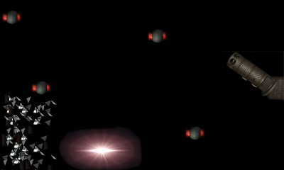



## Grenade Launcher\!\!\!

### Description

Want to know how to make bouncing grenades in your next game, or how to use direct sound? Then look no further: Grenade Launcher! it's fun! Launch grenades from your launcher, and watch them bounce around the screen then explode in a shower of shrapnel! Uses DirectX 7! Plus sound FX!

(you will need DX7VB.dll in you windows system directory.)
 
### More Info
 

             |
---                |---
**Submitted On**   |2000-08-31 18:30:46
**By**             |[Michael Pot&\#232;](https://github.com/Planet-Source-Code/PSCIndex/blob/master/ByAuthor/michael-pot-232.md)
**Level**          |Intermediate
**User Rating**    |4.9 (34 globes from 7 users)
**Compatibility**  |VB 4\.0 \(32\-bit\), VB 5\.0, VB 6\.0
**Category**       |[Graphics](https://github.com/Planet-Source-Code/PSCIndex/blob/master/ByCategory/graphics__1-46.md)
**World**          |[Visual Basic](https://github.com/Planet-Source-Code/PSCIndex/blob/master/ByWorld/visual-basic.md)
**Archive File**   |[CODE\_UPLOAD94718312000\.zip](https://github.com/Planet-Source-Code/michael-pot-232-grenade-launcher__1-11135/archive/master.zip)

